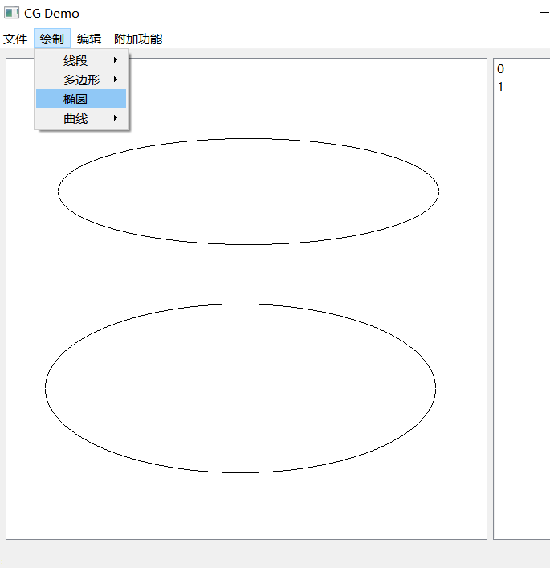
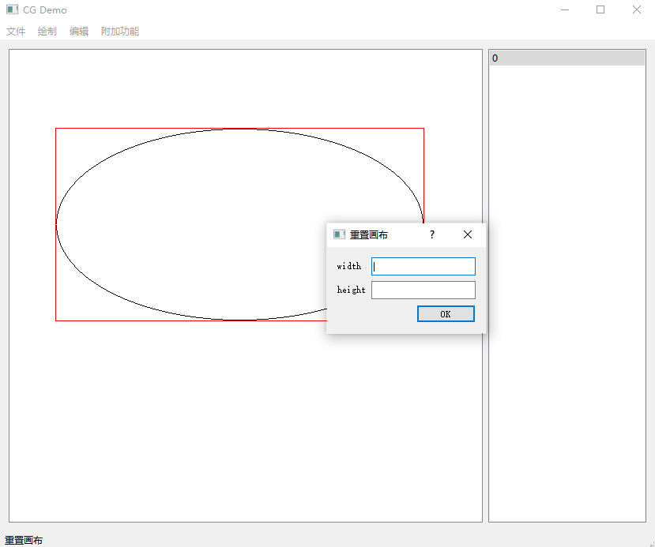
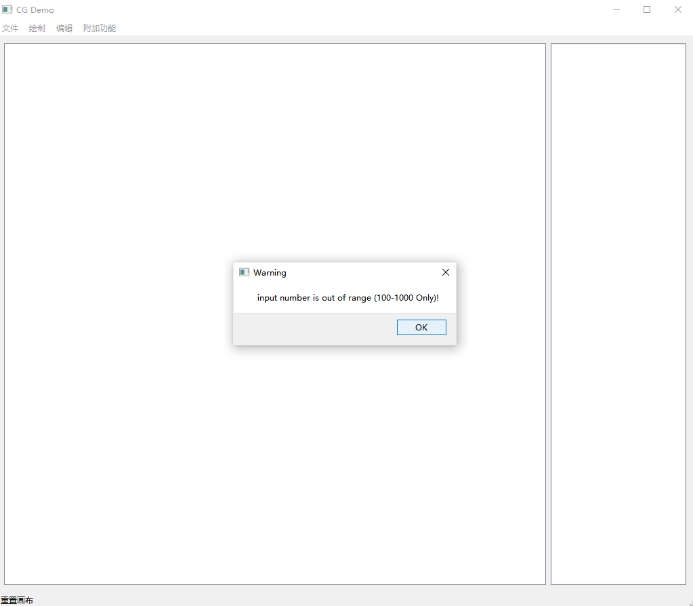

# 2020图形学系统使用说明书

# 基本信息

姓名：佘帅杰

学号：181860077 计算机系

联系方式：3121416933@qq.com

**注：本说明书只要是为了说明整个系统的使用方式**

**对于一个功能的不同算法，如果使用方式一致的就不再给出重复的说明**

# 开发环境

## 开发环境：

**Python 3.7.9 64bits** Windows in vscode

1. PyQt5==5.15.2 
2. numpy==1.18.5
3. Pillow==8.0.1
4. sklearn

## 测试环境：

# 绘图算法

## 直线绘制

如下图

1. 选中对应的菜单并打开，选择所需的绘图算法

2. 在画布中点击鼠标左键选中起始点，按住鼠标左键拖动，此时画布显示当前直线的样子
3. 拖动到所需的位置之后松开鼠标，对应的直线就会被添加到系统里，绘图结束

## 多边形绘制

1. 进入对应的菜单，然后选中所需要的画图算法

2. 点击鼠标左键选中第一个起始点，
3. 获取下一个顶点和边
   1. 可以进行拖动得到边，操作和上面的直线绘制是类似的，已知一个顶点拖动确定另一个点和边
   2. 或者可以直接点击下一个多边形的端点，系统会自动的在两个顶点之间画一条边
4. 反复操作，得到多条边和点
5. 最后点击右键，系统会自动在第一个顶点和最后一个顶点之间建立一条边进行连接，结束绘制

反复操作得到多个顶点和未封闭的边

点击鼠标的右键，系统自动封闭图形，得到最后的多边形，结束绘制

## 椭圆绘制

椭圆没有可以选择的算法，绘制的操作流程基本如下

1. 选中菜单里面的椭圆绘制
2. 在画布中点击鼠标的左键得到起始点
3. 按住鼠标左键拖动，调整椭圆的样子
4. 松开鼠标，系统添加图元，结束绘制

## 曲线绘制

曲线的绘制分为Bezier曲线和B样条曲线绘制

Bezier曲线的绘制的步骤和过程如下

1. 在菜单中正确的选择Bezier算法
2. 点击鼠标左键，选中了第一个起始点
3. 选择下一个控制点，有两种方法
   1. 拖动，一边调整曲线，一边观察曲线，松开鼠标左键代表确认，系统把此点加入控制点
   2. 直接点击左键，即可选中和添加下一个控制点
4. 反复进行上面的操作，直到用户需要满足，**然后点击右键确认绘制结束**
5. **在这个绘制期间直到确认绘制结束前，不可选择菜单栏和切换模式（系统已经做了对应的约束）**

B样条曲线的绘制流程

1. 在菜单中选择和点击B样条算法
2. 点击左键选中了第一个点
3. 选择下一个控制点同样有两种方法
   1. 一种是点击鼠标左键拖动，满意之后松开
   2. 另一个直接点击想要的控制点，松开即可加入
4. 反复选择和添加控制点，直到用户满意，点击鼠标左键可以结束绘制，系统添加对应的图元
5. 注意：这里同样的不可以在绘制的过程中选择菜单和模式切换，需要等到右键事件结束绘制
6. 注意：在控制点小于等于3的时候B-Spline算法展示两条边，其他时间正常的显示曲线（如下）

B样条控制点不足的时候

多选了一个控制点后的图像变化（控制点的选择和添加见说明说）

# 图元操作

## 平移

平移是图元操作的一种，操作的基本步骤如下

1. 首先也是最重要的一步就是选中图元，选中图元可以通过鼠标和旁边的列表，选中成功即显示对应的红框
2. 然后进入菜单编辑，鼠标左键选择平移
3. 点击画布的任意的一个位置，拖动鼠标移动，图元随之移动。
4. 松开鼠标图元停止移动并停留在对应的位置
5. 只要还处于选中图元且平移状态即可反复操作

下图为例子，步骤1，2即选中图元

步骤3，4之后，可见图元位置变化

可选中其他状态，下面以画多边形为例，可见系统正常工作，平移后的图元位置正确

## 旋转

旋转的操作相对复杂一些

1. 选中图元
2. 鼠标左键点击，选择旋转中心
3. **使用滚轮调整旋转角度**，正反两个方向的滚轮可以调整旋转的方向
4. 松开鼠标，系统即可获取绘制的图元

下面是一个实际操作的例子

绘制一个多边形然后选中，可以看到多边形已经有了一个选中的边框

点击菜单选中裁剪功能

然后在五角星的相对中心点击一下，对应的就是选中旋转中心

接下来滑动滚轮，即可看到对应的图元变化

反方向滑动滚轮同理，这里就不再反复的赘述和展示

## 缩放

缩放的基本使用步骤如下

1. 准备和选中图元，同理，选择成功可以看到选中的边框
2. 在菜单中选中缩放功能（鼠标左键）
3. 在画布中点击，选中缩放中心
4. 紧接着选中缩放中心，按住鼠标的左键不放开，拖动鼠标的左键，缩放图元直到满意位置
5. 松开鼠标，如果觉得当前的大小比较合适，则点击右键，下一次的缩放会从当前的状态开始
6. 如果没有点击右键，下次的缩放还是会从上一次的编辑开始
7. 不管是否点击右键进行确认，切换状态都会让系统保存当前的结果

以中心作为缩放中心后的缩放结果

不用中心作为缩放中心的缩放（可以看到中心的位置发生了偏移，如果这个时候点击了右键进行确认，则继续点击和拖动的缩放的控制点就是按照现在编辑后的，反之如果没有使用右键进行确认，就会使用原来的中心还在画布中心的那个图元）

## 裁剪

两种算法的使用方法是一样的，这里不做重复的赘述

基本流程如下

1. 选中图元，同理这里会看到有红色的轮廓框说明已经选中成功了
2. 然后去菜单里选中对应的功能和想要使用的算法
3. 点击鼠标右键，选择一个裁剪窗口的起始点（注意不要放开鼠标左键）
4. 按住鼠标拖动，可以看到一个蓝色的框，这个就是对应的裁剪窗口，可以拖动以修改窗口
5. 如果对第3和第4确定的窗口不满意，可以重新回到第三步，点击选择起始点
6. 反复的操作之后得到了想要的裁剪结果，松开鼠标左键，点击鼠标右键可以锁定结果
7. 注：如果裁剪窗口里不含有任意的图元部分，会导致系统删除这个直线图元，如果不希望这么做请查看第5条说明，可以重新选择
8. 注：由于操作中存在有可能的状态变化操作，因此这里同样限制了，如果没有使用右键进行确认编辑结果，会锁定菜单键禁止状态转移

下图是一个操作的例子，先绘制一个图元

这个时候就可以按照说明步骤里的2，3，4进行操作，例子中可以得到如下的例子，蓝色的框就是一个

裁剪窗口，可以看到顺利的裁剪

下面的例子是一个裁剪空的，下图是还没有点击右键的状态，假设用户真的狠下心了打算删除，点击右键即可确认，同时会导致该图元被删除，如果后悔了，可以参考说明7

# GUI功能

## 重置画布

重置画布功能包含了删除和重置画布大小的功能

操作的流程相对简单一些

1. 点击菜单进入重置画布功能
2. 如果成功可以看到有一个弹窗，如下图的例子所示，要求输入画布的宽度和长度
3. 使用键盘进行输入（注意：这里根据GitLab的README要求，100 <= width, height <= 1000）因此这里的输入要求符合数据约束），下图为例输入了800和800（原先是600，600）
4. 点击OK执行更改，即可

下图是一个操作的例子，如上1，2操作，输入800，800

结果如下所示（这里插入的图片在Typora里都选择了缩放67%，可以看到图二显著大于图一且选择和图元都被清空了，正如README里的要求）

最后的一张图是尝试输入一个错误的输入（例子中输入了600，20）结果见图

## 保存画布

这个功能的基本使用流程如下

1. 进入菜单，点击文件，可以看到选项里的保存画布
2. 然后鼠标左键选中保存画布功能
3. 即可看到一个弹窗（和常见的文件保存的弹窗是一样的

## 清空画布

## 

# 拓展功能

## 鼠标选择图元

## 复制

## 粘贴

## 删除

## 自由绘制

